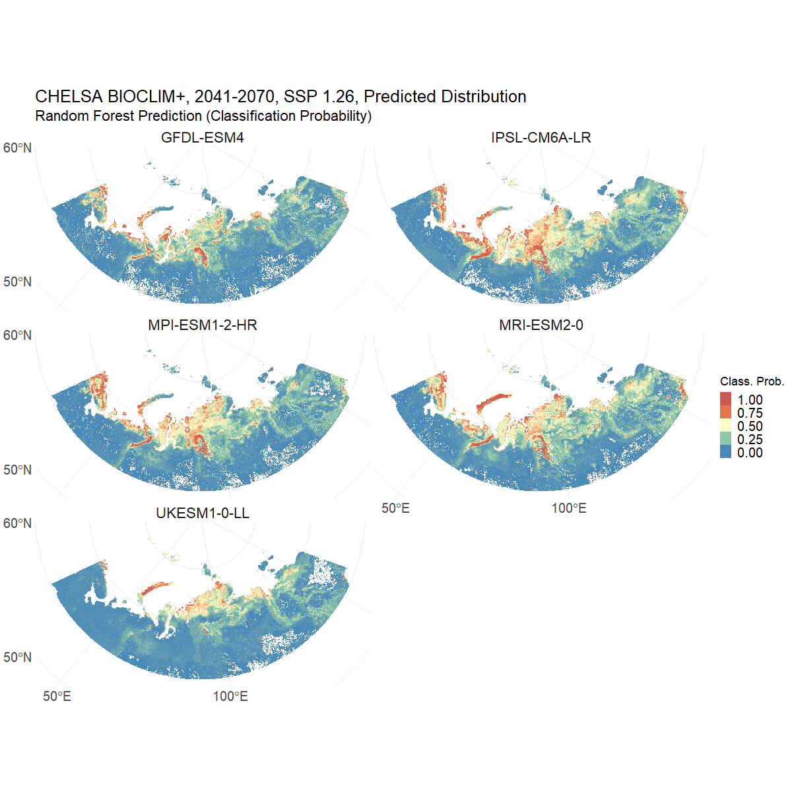

# Polar_RandomForest
The chunks of code inside this repository are part of my [M.Sc. Thesis](https://github.com/cmirb/Polar_RandomForest/blob/main/M_Sc__Thesis_Mirbach_2023.pdf) on: Data-Driven Predictions of Salix lanata Distributions in Arctic Climates. A Machine Learning Approach. Not meant to be run consecutively. The code is provided for transparency and reproducibility purposes.

## Predicting Species Distributions under Climate Change
The animation below shows the predicted distributions of Salix lanata in the Arctic region for the period 2041-2070. The predictions were made using a Random Forest model trained on the current distribution of the species and climate data from the CHELSA Bioclim database, based on downscaled CMIP6 model output. The model was trained using the `randomForest` package in R. The predictions were made using the `terra` package in R. The animation was created using the `ggplot2` and `gganimate` packages in R.

